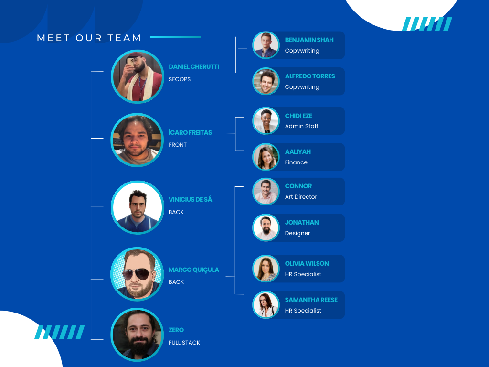

# Gestão de Quartos - Sistema Hoteleiro

#Precisamos definir qual o nome será do sistema.

## Descrição

Este projeto tem como objetivo desenvolver um sistema para gerenciar a ocupação dos quartos de um hotel, desde a reserva até a limpeza. O sistema foca em garantir a eficiência das operações e a satisfação dos hóspedes.

## Equipe

## Tecnologias Utilizadas

* **Linguagem de programação:** [Insira a linguagem a ser definida, ex: Python, Java, C#]
* **Framework:** [Insira o framework utilizado, ex: Django, Spring, ASP.NET]
* **Banco de dados:** [Insira o banco de dados utilizado, ex: PostgreSQL, MySQL]
* **Outras tecnologias:** [Insira outras tecnologias relevantes, ex: Docker, Kubernetes]

## Arquitetura

* **Diagrama de classes:** [Incluir um diagrama de classes simplificado para ilustrar as entidades e suas relações]
* **Contexto delimitado:** Gestão de quartos
* **Principais entidades:** Quarto, Reserva, Hóspede, Camareira
* **Serviços:** RealizarReserva, RealizarCheckIn, RealizarCheckOut, LimparQuarto
* **Padrões de projeto:** [Incluir os padrões de projeto utilizados, ex: Repository, Factory]

## Funcionalidades

* **Reserva de quartos:** Permite reservar um quarto para um determinado período.
* **Gerenciamento de hóspedes:** Cadastro e gerenciamento dos dados dos hóspedes.
* **Check-in/check-out:** Realização do check-in e check-out dos hóspedes.
* **Limpeza de quartos:** Gerenciamento da limpeza dos quartos e atribuição de tarefas às camareiras.
* **Relatórios:** Geração de relatórios sobre a ocupação dos quartos, receitas e outras métricas.

## Como Contribuir

1. **Forkar** este repositório.
2. **Criar uma branch** para sua nova feature ou correção de bug.
3. **Fazer as suas alterações** e commitar.
4. **Abrir um Pull Request** para que suas alterações sejam revisadas.

## Próximos Passos

* **Implementar** as funcionalidades restantes.
* **Realizar testes** unitários e de integração.
* **Desenvolver a interface do usuário** (se aplicável).
* **Implementar a segurança** do sistema.
* **Deployer** o sistema em um ambiente de produção.

## Autores

* Listar autores do projeto, autores estão sendo candidatados.

## Licença

Este projeto está licenciado sob a licença [Nome da licença] - veja o arquivo LICENSE para mais detalhes.
